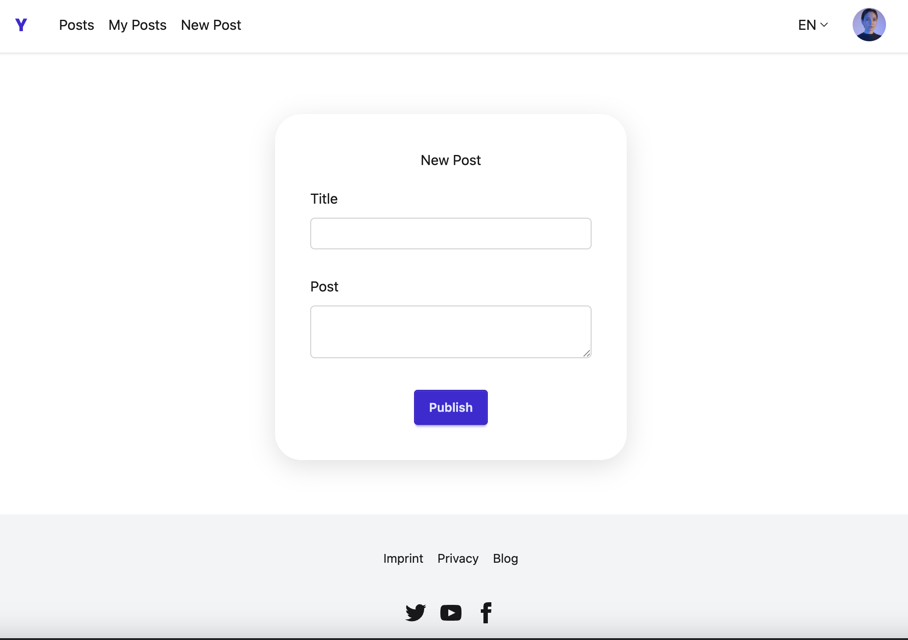

# MERN App Boilerplate

A full-stack starter template for building modern web applications using the **MERN stack** (MongoDB, Express, React, Node.js). This boilerplate is **type-safe** with **TypeScript**, features **JWT authentication** (access & refresh tokens), and comes pre-styled with **Tailwind CSS** and **DaisyUI**. Also includes example **REST API endpoints** for creating and reading posts.

---

## Features

- **MERN Stack**: MongoDB, Express, React, Node.js  
- **TypeScript** throughout (client and server) for type safety 
- **Tailwind CSS + DaisyUI** for rapid and clean UI development  
- **Translation-ready UI** using `react-i18next`
- **Authentication** with JWT access and refresh tokens, emails via Resend  
- **RESTful API** with example routes for reading and writing posts
- **Scalable Project Structure** for easier maintainability

---

## Preview



### Prerequisites

- Node.js (v18+)
- MongoDB (local or Atlas)
- [Resend account](https://resend.com/) for email sending

---

### Getting started

Clone the repository
```bash
git clone git@github.com:katharina-spiecker/fullstack-mern-example.git
cd fullstack-mern-example
```

#### Environment Variables
1. Create a .env file in the backend and in the frontend directory each by copying the provided .env.example files.
2. For the development server, you can keep the default value in the frontend .env file. Adjust the .env file in the backend directory.
```bash
DB_URI=our_mongodb_connection_string
ACCESS_TOKEN_SECRET=your_access_token_secret
REFRESH_TOKEN_SECRET=your_refresh_token_secret
ACCESS_TOKEN_EXPIRATION_MS=18000 # milliseconds until expiration
REFRESH_TOKEN_EXPIRATION=7d # 7 days
RESEND_API_KEY=your_resend_api_key
RESEND_DEV_EMAIL=your_resend_account_email # during dev mode, only emails to account email permitted
FRONTEND_URL_CORS=http://localhost:5173
```


#### Installation
Install backend dependencies and start development server
```bash
cd backend
npm install
npm run dev
```

Install frontend dependencies and start development server
```bash
cd frontend
npm install
npm run dev
```


